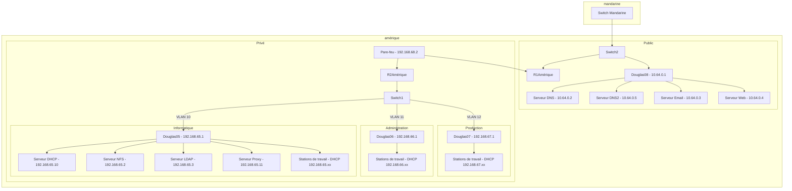

# Équipe AMERIQUE

Le sujet du projet est disponible [ici](README.md).

## Structure du projet

- projet/ : Contient les documents et comptes-rendus liés à l'avancement du projet.

  - cr-AAAA-MM-JJ-label.md : Compte-rendu de réunion.
  - cr-LOGIN.md : Suivi d'avancement quotidien par participant.
  - prez-AAAA-MM-JJ-label.md : Support de présentation.
  - rapport-AAAA-MM-JJ-label.md : Rapports de projet.

- doc/ : Documentation produite par l'équipe.

- ext/ : Fichiers externes (avec leur source dans ext/SOURCES).

- bin/ : Programmes exécutables.

- lib/ : Bibliothèques utilisées par les programmes.

## Tâches effectués

- Configuration Switch & Routeur (Réseau public & réseaux privés, VLAN,NAT,Translation de port,etc). 
- Serveur Mail, Proxy, Web, DHPC, LDAP, NFS, DNS 1, DNS 2.
- Configuration PAM, intégration LDAP & NFS cliente.
- Installation et filtrage pare-feu (Stormshield).
- Mise en place et configuration des stations de travail.

## Répartition des tâches 

| Service                  | Responsable(s)                    |
|--------------------------|------------------------------------|
| DHCP                     | C, B, Arthur         |
| DNS1                     | B                         |
| DNS2                     | C, Arthur                   |
| LDAP                     | B, Arthur (script)        |
| PAM                      | B                         |
| NFS                      | Arthur, C                   |
| Station de travail       | B, Arthur                 |
| Serveur mail             | C, B                 |
| Proxy                    | C                           |
| Pare-feu                 | C                           |
| Switch, routeur privé  | C                           |
| Serveur Web              | Arthur                           |
| Configuration douglas    | C, Arthur (script Douglas)  |
| Documentation            | Arthur, C, B         |

## Difficultés rencontré

- Mise en place du pare-feu (Stormshield).
- Les routes qu'efface vagrant lors des provision.
- Le DHCP avec le problème des adresses MAC qui changeaient à cause des vagrant destroy puis vagrant up.
- La translation de port 389 pour le serveur mail se trouvant sur le réseau public pour avoir accès à la base LDAP qui pouvait parfois ne pas trouver la base LDAP lorsque l'on faisait des vagrant destroy puis vagrant up, résolu en mettant des adresses MAC fixe également.

## Tâches non réalisés 

- Extensions bonus (ipv6,vpn,wifi)

## Topologie logique

## Topologie physique

## Tableau d'adressage :

| **Service / Équipement** | **Interface / Rôle**   | **Adresse IP**       | **VLAN / Interface**          |
| ------------------------ | ---------------------- | -------------------- | ----------------------------- |
| **Routeur (R2Amerique)** | FastEthernet4.10       | 192.168.65.254/24    | VLAN 10 (Informatique)        |
|                          | FastEthernet4.11       | 192.168.66.254/24    | VLAN 11 (Administration)      |
|                          | FastEthernet4.12       | 192.168.67.254/24    | VLAN 12 (Production)          |
|                          | Vlan5                  | 192.168.68.1/29      | VLAN 5 (Interconnexion)       |
|                          | Routes statiques       |                      | Vers 10.0.0.0, 192.168.69.0   |
| **Routeur (R1fai)**      | FastEthernet4.20       | 10.64.0.1/16         | VLAN 20                       |
|                          | Vlan5                  | 192.168.69.2/29      | VLAN 5 (Interconnexion)       |
|                          | Routes statiques       |                      | Vers 0.0.0.0, 192.168.65.0/24 |
| **Partie privée**        |                        |                      |                               |
|                          | Pare-feu (Stormshield) | 192.168.68.2         | VLAN 5 (Interconnexion)       |
| Service Informatique     | Douglas05              | 192.168.65.1         | -                             |
|                          | Serveur DHCP           | 192.168.65.10        | VLAN 10 (Informatique)        |
|                          | Serveur NFS            | 192.168.65.2         | VLAN 10 (Informatique)        |
|                          | Serveur LDAP           | 192.168.65.3         | VLAN 10 (Informatique)        |
|                          | Serveur Proxy          | 192.168.65.11        | VLAN 10 (Informatique)        |
|                          | Stations de travail    | DHCP (192.168.65.xx) | VLAN 10 (Informatique)        |
| Service Administration   | Douglas06              | 192.168.66.1         | -                             |
|                          | Stations de travail    | DHCP (192.168.66.xx) | VLAN 11 (Administration)      |
| Service Production       | Douglas07              | 192.168.67.1         | -                             |
|                          | Stations de travail    | DHCP (192.168.67.xx) | VLAN 12 (Production)          |
| **Partie publique**      | Douglas07              | 10.64.0.1            | -                             |
|                          | Serveur DNS            | 10.64.0.2            | FastEthernet4.20              |
|                          | Serveur DNS2           | 10.64.0.5            | FastEthernet4.20              |
|                          | Serveur Email          | 10.64.0.3            | FastEthernet4.20              |
|                          | Serveur Web            | 10.64.0.4            | FastEthernet4.20              |

### Fichier de configuration de l'infrastructure

| Matériel             | Documentation                                           |
| -------------------- | ------------------------------------------------------- |
| Routeur 1 (Amerique et FAI)      | [Fichier de configuration](doc/configurations_commutateurs_et_routeurs/fichiers_cisco/R1AmeriqueFAI) |
| Routeur 2 (Amerique) | [Fichier de configuration](doc/configurations_commutateurs_et_routeurs/fichiers_cisco/R2Amerique)  |
| Switch 1 (Amerique)  | [Fichier de configuration](doc/configurations_commutateurs_et_routeurs/fichiers_cisco/S1Amerique)  |
|                      |                                                         |

### Services

| Services            | Documentation                                                                                               |
| ------------------- | ----------------------------------------------------------------------------------------------------------- |
| DHCP                | [Documentation DHCP](doc/serv_DHCP/DHCP.md)                                                                 |
| DNS                 | [Documentation DNS](doc/serv_DNS/DNS.md)                                                                    |ddd
| LDAP                | [Documentation LDAP](doc/serv_LDAP/LDAP.md) / [Documentation cliente LDAP](doc/serv_LDAP/CLIENT_LDAP.md) |
| Mail                | [Documentation Mail](doc/serv_mail/mail.md)                                                                 |
| NFS                 | [Documentation NFS](doc/serv_NFS/NFS.md)                                                                    |
| Proxy               | [Documentation Serveur Proxy](doc/serv_proxy/proxy_web.md)                                                  |
| Web                 | [Documentation Serveur Web](doc/serv_web/nginx.md)                                                          |
| Stations de travail | [Documentation Stations de travail](doc/workstation/workstation.md)                                         |
| Pare-feu            | [Documentation Pare-feu](doc/pare-feu/pare-feu.md)                                                         |  | 
Switch et routeurs  | [Configuration Commutateurs et routeurs](doc/configurations_commutateurs_et_routeurs/configuration_commutateurs_et_routeurs.md)                |                                                                                                             

## Comptes-rendu - Liens rapide

### Comptes-rendu étudiant

Les comptes-rendu quotidiens d'[Arthur](projet/cr-etudiant/cr-arthurdebacqetu.md), [Younes](projet/cr-etudiant/cr-younesbensyedetu.md) et [Valentin](projet/cr-etudiant/cr-valentinhebertetu.md) sont disponibles en cliquant sur nos prénoms ou en consultant le contenu du dossier `projet` puis `cr-etudiant`.

### Comptes-rendu hebdomadaire

Les comptes-rendu hebdomadaires sont disponibles via la liste ci dessous dans l'ordre chronologique :

| Semaine              |                                                                     |
| -------------------- | ------------------------------------------------------------------- |
| Semaine 1 (04/10/24) | [Compte rendu](projet/cr-hebdomadaire/cr-2024-10-04-bilan-hebdo.md) |
| Semaine 2 (17/10/24) | [Compte rendu](projet/cr-hebdomadaire/cr-2024-10-18-bilan-hebdo.md) |
| Semaine 3 (15/11/24) | [Compte rendu](projet/cr-hebdomadaire/cr-2024-11-15-bilan-hebdo.md) |
| Semaine 4 (28/11/24) | [Compte rendu](projet/cr-hebdomadaire/cr-2024-11-29-bilan-hebdo.md) |
| Semaine 5 (13/12/24) | [Compte rendu](projet/cr-hebdomadaire/cr-2024-12-13-bilan-hebdo.md) |
| Semaine 6 (11/01/25) | [Compte rendu](projet/cr-hebdomadaire/cr-2025-01-11-bilan-hebdo.md) |

