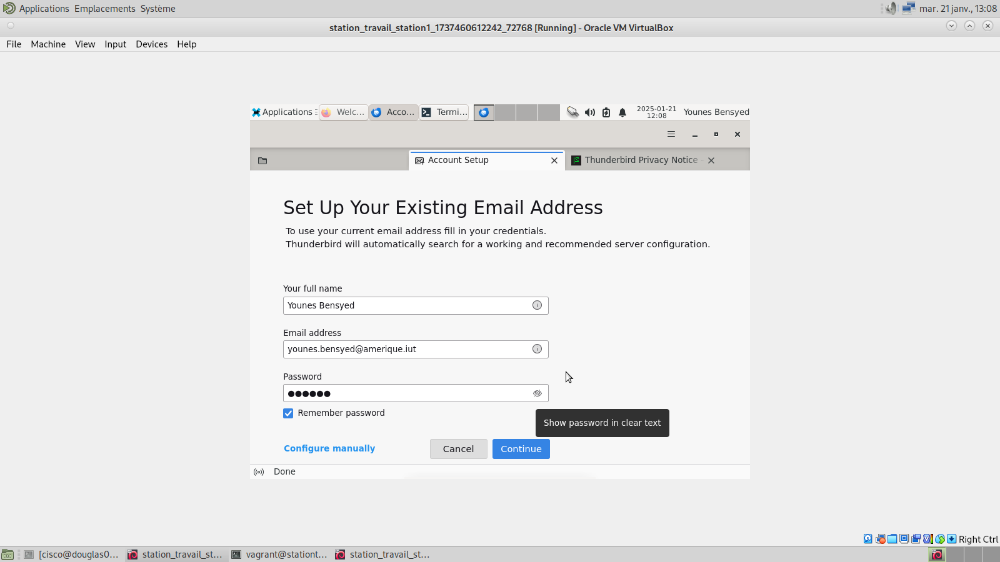
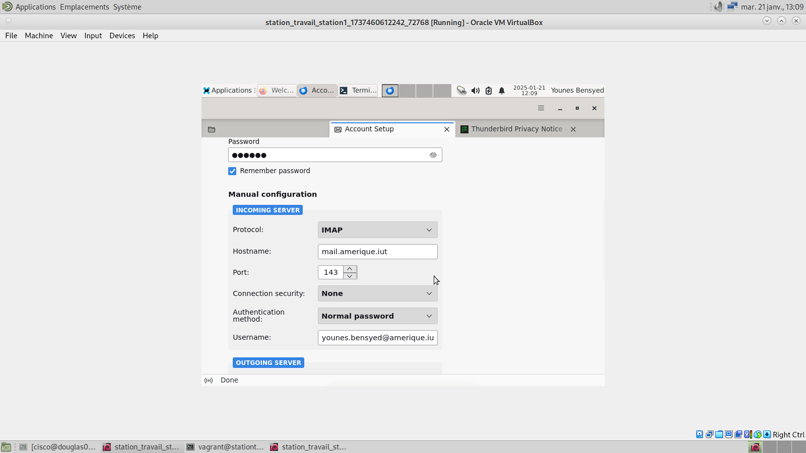
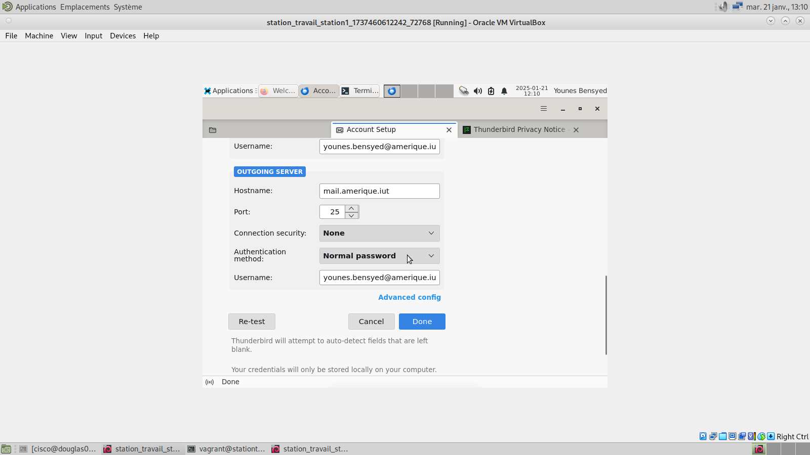
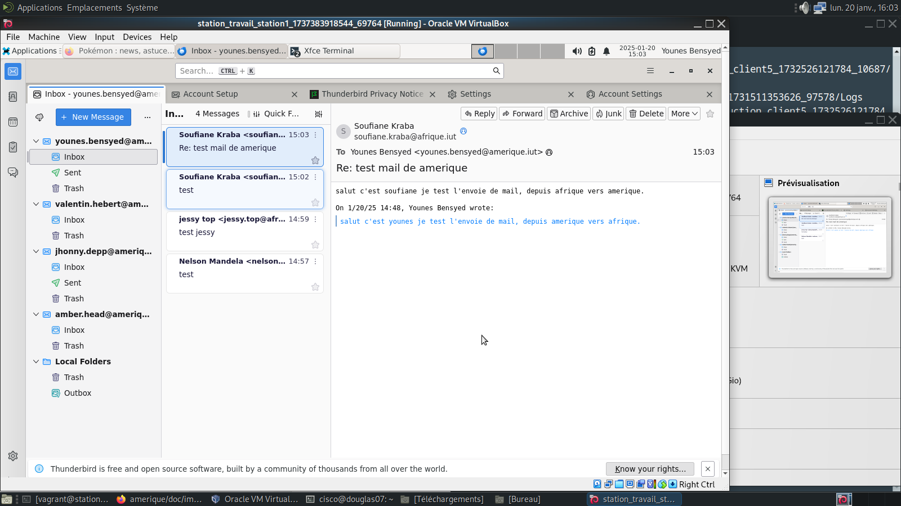

## Pourquoi utiliser Postfix et Dovecot ?

Postfix et Dovecot sont des solutions open-source, fiable et très performant, offrant un très grand nombre d'options de personnalisation.

Postfix permet l'envoi et le routage des mails via le protocole SMTP (port 25), quant à Dovecot, il se charge de la réception ainsi que du stockage, et de l'accès aux boîtes mail via le protocole IMAP (port 143)


# Mise en place du serveur Mail

On installe les paquets nécessaire à la mise en place du serveur mail

```sh
DEBIAN_FRONTEND=noninteractive apt install -y postfix-ldap dovecot-core dovecot-ldap dovecot-imapd
```

On défini le nom d'hôte du serveur, pour l'identifier dans les échanges smtp et dns
```sh
hostnamectl set-hostname mail.amerique.iut
```


# Configuration de Postfix


Le nom de domaine référence pour les mail envoyé et reçu
```sh
echo "postfix postfix/mailname string amerique.iut" | debconf-set-selections
```

Lorsqu'un mail est envoyé, se fichier permet de configurer une recherche LDAP pour valider les adresses mail des expéditeur, cela limite l'accès au serveur SMTP.
/etc/postfix/sender_login_maps.cf

```sh
server_host      = 10.64.0.1
server_port      = 389
bind             = yes
start_tls        = no
version          = 3
bind_dn          = cn=admin,dc=amerique,dc=iut
bind_pw          = azerty
search_base      = dc=amerique,dc=iut
scope            = sub
query_filter     = (mail=%s)
result_attribute = mail
```

Postfix configure des boîtes mail virtuelles, associer des boîtes mail à leur répértoires par rapport au répértoire vmail.
 /etc/postfix/virtual_mailbox_maps.cf

```sh
server_host      = 10.64.0.1
server_port      = 389
bind             = yes
start_tls        = no
version          = 3
bind_dn          = cn=admin,dc=amerique,dc=iut
bind_pw          = azerty
search_base      = dc=amerique,dc=iut
scope            = sub
query_filter     = (&(mail=%s)(objectClass=inetOrgPerson))
result_attribute = mail
result_format    = /home/vmail/%d/%u/mailbox/
debuglevel       = 0
```
Par exemple, pour l'email younes.bensyed@amerique.iut, la recherche sera (&(mail=younes.bensyed@amerique.iut)(objectClass=inetOrgPerson)), si la correspondance mail est trouvé alors la localisation de la boîte sera dans /home/vmail/amerique.iut/younes.bensyed/mailbox/


main.cd est le fichier principale de la configuration postfix, il permet de configurer les paramètres essentiels de smtp
/etc/postfix/main.cf

```sh
smtpd_banner = \$myhostname ESMTP #bannière lorsque le serveur envoi lors d'une connexion
biff = no
append_dot_mydomain = no
compatibility_level = 3.6

myhostname = mail.amerique.iut #nom d'hôte du serveur
alias_maps = hash:/etc/aliases
alias_database = hash:/etc/aliases
myorigin = /etc/mailname
mydestination = \$myhostname, localhost #domaine locaux 
relayhost = 
mynetworks = 127.0.0.0/8 #réseaux autorisé
mailbox_size_limit = 0
recipient_delimiter = +
inet_interfaces = all
inet_protocols = all

#configuration de smtpd (serveur smtp de postfix)

smtpd_relay_restrictions = permit_mynetworks permit_sasl_authenticated defer_unauth_destination #règles de relai des mail
smtpd_sasl_auth_enable = yes #activation de l'authentification sasl
smtpd_sasl_type = dovecot #postfix utilise dovecot pour identifier les utilisateurs
smtpd_sasl_path = private/auth_dovecot
smtpd_recipient_restrictions = permit_sasl_authenticated, permit_mynetworks, reject_unauth_destination #règle pour accpeter ou refuser des mail

#configuration des boîtes mail virtuelle

virtual_mailbox_base = /home/vmail/ #chemin pour les boîtes mail virtuelle
virtual_uid_maps = static:5000 #iud de l'utilisateur vmail
virtual_gid_maps = static:5000 #gid de l'utilisateur vmail
virtual_transport = dovecot #dovecot gère la distribution des mail
virtual_mailbox_domains = \$mydomain #le domaine virtuel
smtpd_sender_login_maps = ldap:/etc/postfix/sender_login_maps.cf #vérifie si l'utilisateur peut envoyer des mail
virtual_mailbox_maps = ldap:/etc/postfix/virtual_mailbox_maps.cf #localise et valide les boîtes mail virtuelles

local_recipient_maps = \$virtual_mailbox_maps #les destinataires locaux sont défini via leur boîtes mail virtuelles
```

le fichier master.cf permet de définir, les connexion, filtres et agents de transports comme dovecot pour la livraison des mail. on rajoute dedans que dovecot est utilisé comme agent de livraison pour les boîtes mail dans postfix
/etc/postfix/master.cf
```sh
flags=DRhu user=vmail:vmail argv=/usr/lib/dovecot/deliver -d \${recipient} 
```
les mail destiné à amerique.iut seront envoyé a dovecot
/etc/postfix/transport
```sh
amerique.iut dovecot
```

# Configuration de Dovecot

On configure dovecot pour une authentification ldap
/etc/dovecot/dovecot.conf
```sh
auth_mechanisms = plain login
disable_plaintext_auth = no
mail_uid = vmail
mail_gid = vmail
login_log_format_elements = "user=<%u> method=%m rip=%r lip=%l mpid=%e %c %k"
protocols = imap
listen = * #port sur écoute

#liaison de la base ldap pour gèrer les utilisateurs et leur mots de passes
userdb {
  args = /etc/dovecot/dovecot-ldap-user.conf.ext
  driver = ldap
}
passdb {
  args = /etc/dovecot/dovecot-ldap-pass.conf.ext
  driver = ldap
}

#authentification des utilisatteurs via postfix
service auth {
  unix_listener /var/spool/postfix/private/auth_dovecot {
    group = postfix
    mode = 0660
    user = postfix
  }
  unix_listener auth-userdb {
    mode = 0600
    user = vmail #seulement l'utilisateur vmail peut y accéder
  }
  user = root #dovecot est excécuté comme root
}
#permet de gérer les dictionnaires, qui contiennent les informations des utilisateurs ou leur boîtes mail
service dict {
    unix_listener dict {
        mode = 0660
        user = vmail
        group = vmail
    }
}
```

Authentification ldap afin de récupérer les informations utilisateurs: répertoire mail, chemins de stockage des emails via Dovecot.
/etc/dovecot/dovecot-ldap-user.conf.ext
```sh
hosts = 10.64.0.1
dn = cn=admin,dc=amerique,dc=iut
dnpass = azerty
debug_level = 0
auth_bind = no
ldap_version = 3
base = dc=amerique,dc=iut
scope = subtree
user_attrs = \
  =home=/home/vmail/%d/%{ldap:uid}, \  # associe l'utilisateur à son répertoire mail.
  =mail=maildir:/home/vmail/%d/%{ldap:uid}/mailbox #chemin vers de dossier ou sont stocker les mails (maildir)
user_filter = (mail=%u) #filtre pour les utilisateurs
iterate_attrs        = mail=user
iterate_filter       = (objectClass=person)
```

On récupére les mots de passe des utilisateurs pour réaliser leur authentification 
/etc/dovecot/dovecot-ldap-pass.conf.ext
```sh
hosts  = 10.64.0.1
dn = cn=admin,dc=amerique,dc=iut
dnpass = azerty
debug_level = 0
auth_bind = no
ldap_version = 3
base = dc=amerique,dc=iut
scope = subtree
pass_attrs = mail=user,userPassword=password #attribue ldap nécéssaire pour récupérer le mail et le mot de passe
pass_filter = (&(mail=%u)(objectClass=person)) #filtre pour trouver les mails des utilisateurs
default_pass_scheme = PLAIN #mot de passe sans cryptage
```

On configure notre utilisateur vmail avec son répertoire /home/vmail/ où seront stocker les mails.
```sh
groupadd --gid 5000 vmail
useradd -g vmail -u 5000 -d /home/vmail -m vmail
chown -R vmail:vmail /home/vmail
chmod 700 /home/vmail
```

# Connexion thunderbird









# Test d'nevoie et de réception de mail entre le groupe amerique et le groupe afrique

Je suis connecter à mon client sur le compte Younes Bensyed
J'ai envoyé un mail au groupe afrique, ils l'ont bel et bien reçu, et on pu à leur tour me faire des réponse à mes mail.




## Retour au sommaire

- [Retourner au sommaire](../../README.md#documentations---liens-rapide)