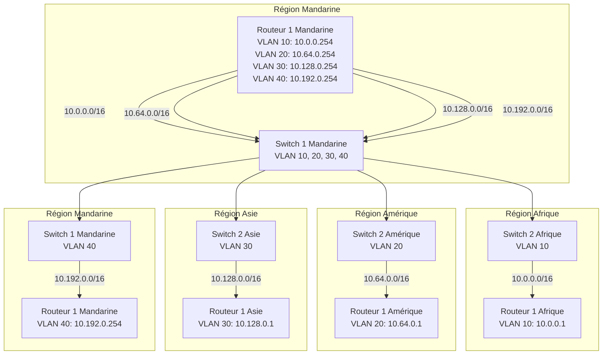
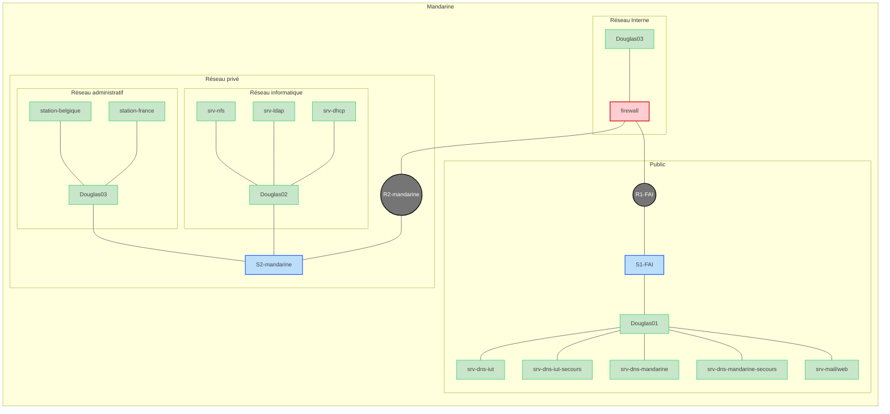

# Équipe MANDARINE (FAI)

## Introduction
L'équipe Mandarine est composée des membres suivants :
- **Halim BENIA LATRECHE**
- **Adham BERRAKANE**
- **Arthur KELLER**
- **Gabriel ROBAT**

---

## Le Projet 

### Tâches éxécutées : 

#### Halim BENIA-LATECHE

- Mise en Place de l'infrastructure réseau 
- DHCP
- Firewall 
- Mail
- Essai VPN 
- Documentations 
- Aide générale

#### Adham BERRAKANE

- Mise en Place de l'infrastructure réseau 
- Serveur NFS 
- Serveur LDAP
- client NFS
- client LDAP
- Script ldap (create/modif/suppr)
- Serveur Backup 
- Automatisation du Déploiement
- Documentations 

#### Arthur KELLER

- Mise en Place de l'infrastructure réseau 
- DNS iut
- DNS mandarine
- DNS iut secours
- DNS mandarine secours
- Mail
- Web
- Spamassassin
- Firewall
- DHCP
- Script de provision des machines automatisées
- Schéma réseau publique et de notre infrastructures
- Documentations
- Stations de travail
- Aide générale

#### Gabriel ROBAT

- Mise en Place de l'infrastructure réseau 
- Premiet jet LDAP
- DHCP
- Firewall
- Essai Kerberos 
- Documentations 
- Aide générale

--- 

## Les schémas

### Schéma réseau publique

- [schéma reseau de l'infrastructure publique](./doc/schema-reseau/schéma-reseau-publique.md)

### Schéma réseau mandarine

- [schéma reseau de l'infrastructure mandarine](./doc/schema-reseau/schema-reseau-mandarine.md)

---

### Statut d'avancement du projet
#### Tâches terminées

##### Réseau Public
- **Attribution d'une plage d'adresses IP** pour toutes les organisations.
- Configuration des serveurs DNS :
  - **DNS autoritaire** pour le domaine `.iut`.
  - **DNS autoritaire** pour le domaine `mandarine.iut`.
  - **DNS secondaire** (de secours) pour le domaine `.iut`.
  - **DNS secondaire** (de secours) pour le domaine `mandarine.iut`.
- Mise en place de :
  - **Un serveur mail** pour le domaine `mandarine.iut`.
  - **Un serveur web** pour le domaine `mandarine.iut`.

##### Réseau Privé
- **Sécurisation du réseau privé** grâce à un firewall.

###### Réseau Informatique
- Déploiement des services suivants :
  - **DHCP** pour la gestion dynamique des adresses IP.
  - **LDAP** pour la gestion centralisée des utilisateurs.
  - **NFS** pour le partage des fichiers.
  - Un service de backup pour le service NFS et LDAP
- Configuration d'une **station de travail** équipée de :
  - Un navigateur web.
  - Un outil de gestion des emails via **Rainloop** (interface web).

###### Réseau Administratif
- Mise en place de deux **stations de travail** disposant de :
  - Un navigateur web.
  - Un outil de gestion des emails via **Rainloop** (interface web).

#### Tâches non terminées
- NFSv4
- Service en ipv6
- Vpn
- Accès Wifi

### Points Bloquants 
- Problème concernant l'adressage du réseau Public. 
- Connection entre **LDAP** et **NFS**. 
- Fournir les routes par **DHCP**.
- Bonnes résolutions pour les fichiers de configurations du **DNS** `.iut`. 
- Mise en Place du Firewall en lien avec l'infrastructure.
- Mise en place de Kerberos.
- Très mauvaise communication dans le groupe.

---

## Comptes Rendus

### Comptes Rendus des Étudiants
- [Compte rendu Halim BENIA LATRECHE](./projet/cr-etudiant/cr-halim-benia-latreche-etu.md)
- [Compte rendu Adham BERRAKANE](./projet/cr-etudiant/cr-adham-berrakane-etu.md)
- [Compte rendu Arthur KELLER](./projet/cr-etudiant/cr-arthur-keller-etu.md)
- [Compte rendu Gabriel ROBAT](./projet/cr-etudiant/cr-gabriel-robat-etu.md)

### Hebdomadaires
- [2024-10-03](./projet/cr-hebdomadaire/cr-2024-10-03-bilan-hebdo.md)
- [2024-10-18](./projet/cr-hebdomadaire/cr-2024-10-18-bilan-hebdo.md)
- [2024-11-14](./projet/cr-hebdomadaire/cr-2024-11-14-bilan-hebdo.md)
- [2024-12-13](./projet/cr-hebdomadaire/cr-2024-12-13-bilan-hebdo.md)
- [2025-01-06](./projet/cr-hebdomadaire/cr-2025-01-06-bilan-hebdo.md)

## Documentation

### Adressage IP
- [Tableau d'adressage IP](./doc/table-adressage.md)

### Schémas Réseaux
- [Schéma du réseau public](./doc/schema-reseau/schéma-reseau-publique.md)
- [Schéma du réseau privé Mandarine](./doc/schema-reseau/schéma-reseau-publique.md)

### Configuration des Routeurs et Switches
#### Routeurs
- [Routeur 1 FAI (réseau public)](./doc/configuration/fai/fai-r1.conf)
- [Routeur 2 Mandarine (réseau privé)](./doc/configuration/mandarine/mandarine-r2.conf)

#### Switches
- [Switch 1 FAI (réseau public)](./doc/configuration/fai/fai-s1.conf)
- [Switch 2 Mandarine (réseau privé)](./doc/configuration/mandarine/mandarine-s2.conf)

---

### Réseau Public

#### Serveurs DNS `.iut`
- [Documentation du DNS `.iut`](./doc/dns/dns-iut.md)
- [Documentation du DNS secondaire `.iut`](./doc/dns/dns-iut-secours.md)

#### Serveurs DNS `mandarine.iut`
- [Documentation du DNS `mandarine`](./doc/dns/dns-mandarine.md)
- [Documentation du DNS secondaire `mandarine`](./doc/dns/dns-mandarine-secours.md)

#### Serveur Web
- [Documentation sur le serveur web](./doc/web/serveur-web.md)

#### Serveur Mail
- [Installation du serveur mail](./doc/mail/installation-serveur-mail.md)
- [Ajout d'un domaine dans Postfix](./doc/mail/ajouter-domaine-postfix.md)
- [Ajout d'une adresse mail dans Postfix](./doc/mail/ajouter-adresse-mail.md)
- [Ajout d'un domaine dans Rainloop](./doc/mail/ajouter-domaine-rainloop.md)
- [Gestion des emails via Rainloop](./doc/mail/gerer-mails.md)
- [Installation de spamassassin](./doc/mail/installation-spamassassin.md)

---

### Réseau Privé

#### Serveur DHCP
- [Documentation sur le serveur DHCP](./doc/dhcp/dhcp.md)

#### Serveur LDAP
- [Documentation sur le serveur LDAP](./doc/ldap/ldap.md)

#### Serveur NFS
- [Documentation sur le serveur NFS](./doc/nfs/nfs.md)

#### Stations de Travail
- [Documentation sur les stations de travail](./doc/stations-travail/stations-travail.md)

#### Serveur Backup (NFS/LDAP)
- [Documentation sur les stations de travail](./doc/backup/backup.md)

---

### Firewall
- [Configuration du firewall](./doc/firewall/firewall.md)