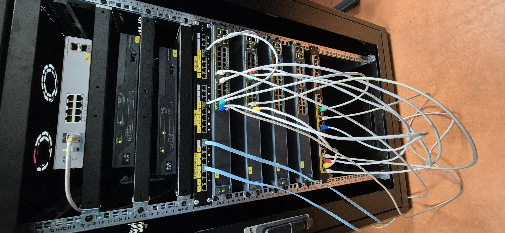

# Cablage de la baie Mandarine

Photo de notre baie :

## Routeur 1
| Nom port utilisé  | Vers quelle machine | Nom du port |
| :---------------: |:---------------:| :---------------:| 
| WLAN4 | Switch1 | Gigabit1 |

## Routeur 2
| Nom port utilisé  | Vers quelle machine | Nom du port |
| :---------------: |:---------------:| :---------------:| 
| WLAN4 | Switch2 | Gigabit1 |

## Switch 1
| Nom port utilisé  | Vers quelle machine | Nom du port |
| :---------------: |:---------------:| :---------------:| 
| 1 | Commutateur machine | 1-2A |
| 2 | Commutateur machine | 1-3A |
| 3 | Commutateur machine | 1-4A |
| 11 | Douglas01 | D01 |
| GigaBit1 | Routeur1 | WLAN4 |
| 13 | Firewall port1 | 1 |

## Switch 2
| Nom port utilisé  | Vers quelle machine | Nom du port |
| :---------------: |:---------------:| :---------------:| 
| 2 | Douglas02 | D02 |
| 3 | Douglas04 | D04 |
| GigaBit1 | Routeur2 | WLAN4 |
| 13 | Firewall | 2 |
| 15 | Douglas03 | D03 |

## Firewall
| Nom port utilisé  | Vers quelle machine | Nom du port |
| :---------------: |:---------------:| :---------------:| 
| 1 | Switch1 | 13 |
| 2 | Switch2 | 13 |

## Baie d'Afrique
| Vers quelle machine | Nom port utilisé  | Vers quelle machine | Nom du port |
| :---------------: |:---------------:| :---------------:|:---------------:|
| Commutateur machine | 1-2A | Switch3 | 1 |