# Firewall StormShield

## 1. Introduction

Mise en place d'un firewall stormshield.
Le firewall permet (dans notre cas) de filter les paquets circulants entre le réseau public et nos réseau privés.
Il permet de filtrer les requêtes ICMP et limiter les paquets smtp au domaine .iut

## 2. Pré-requis

- Avoir alimenté le firewall
- Avoir connecté le firewall au poste `Douglas`(dans notre cas, le 3) (enp0s4)

## 3. Configuration initiale

S'assurer que le firewall et le poste sont sur le même réseau. L'adresse par défaut du Firewall est 10.0.0.254. Il est nécessaire de ne pas avoir de machine possédant déjà cette ip. Configurer l'interface du poste :

    cisco@douglas03:~$ sudo ip a add 10.0.0.3/24 dev enp4s0

Se connecter à firefox : https://10.0.0.254/
> la navigation n'est pas sécurisée, il faut donc cliquer sur **Avancer** puis **Accepter les risques et poursuive**

Il faudra ensuite suivre la procédure d'installation comme ci-dessous :

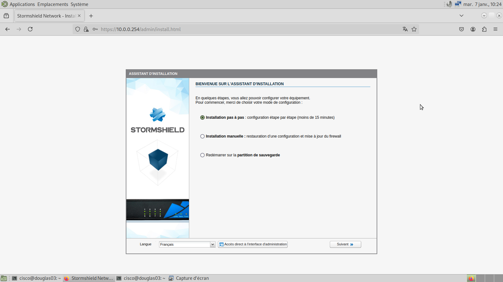
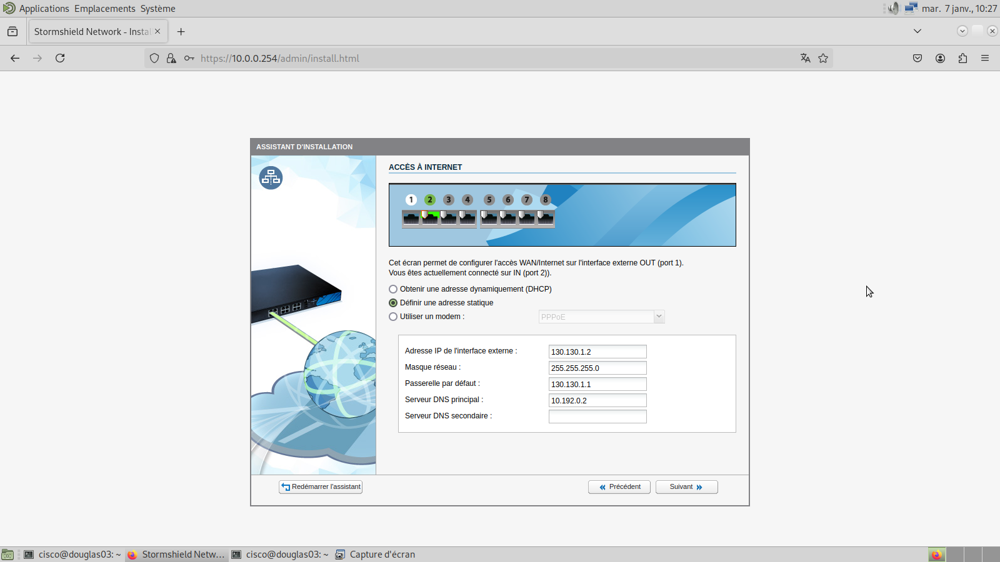
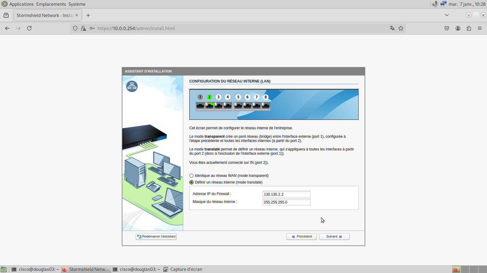
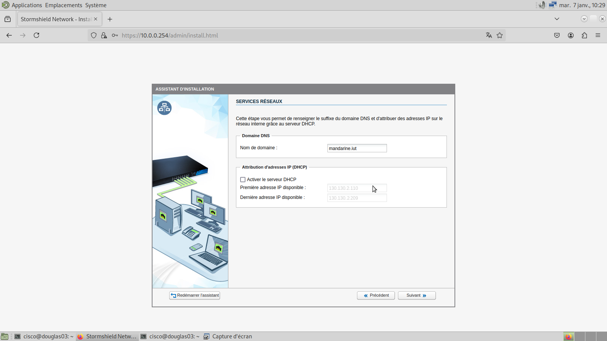
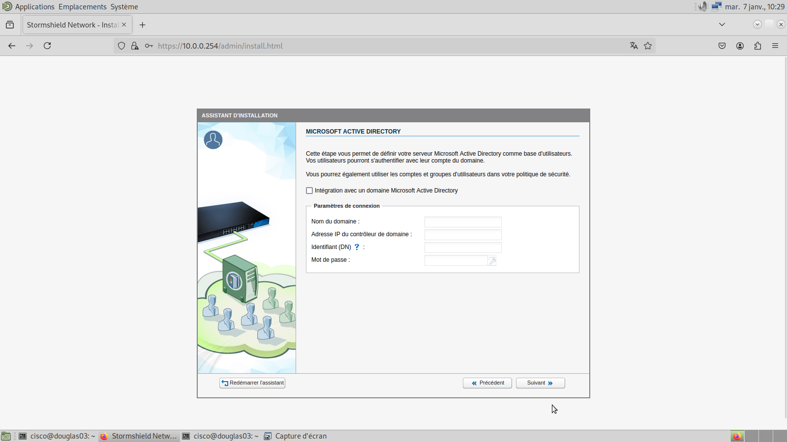
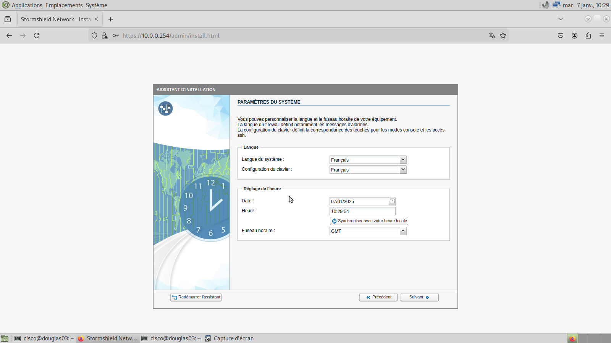
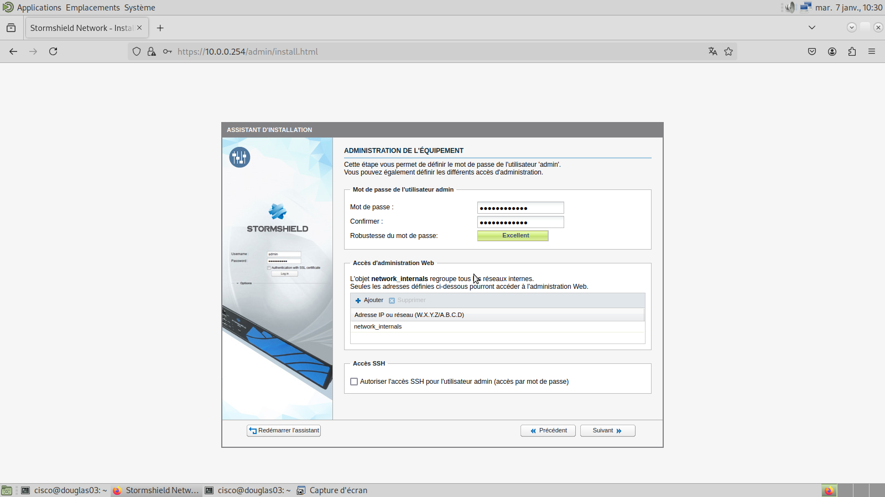
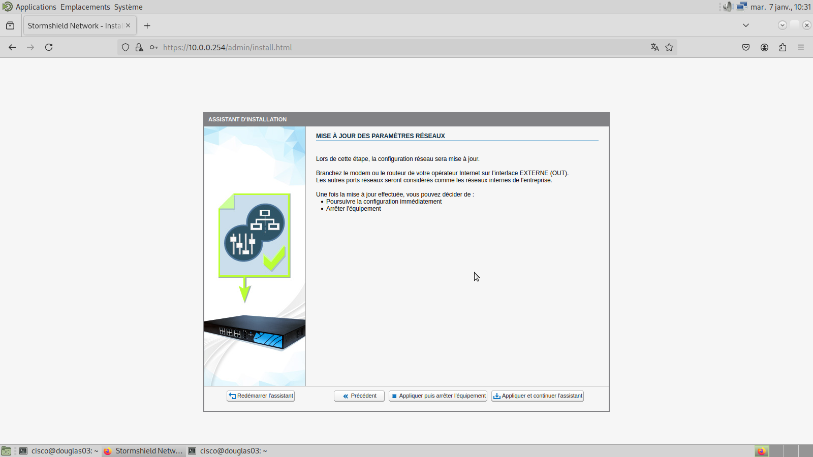

Après avoir **Appliquer et continuer l'assistant**, le firewall va changer d'adresse.
Il faut donc changer l'adresse du poste.

    cisco@douglas03:~$ sudo ip a del 10.0.0.3/24 dev enp4s0
    cisco@douglas03:~$ sudo ip a add 130.130.2.3/24 dev enp4s0

Maintenant, via https://130.130.2.2/admin/admin.html, on peut se connecter au firewall.
En s'identifiant, on peut l'intégrer au projet, et le paramétrer.
Nous avons choisis d'ajouter des réseaux intermédiaires. C'est une solution plus simple que de devoir configurer le firewall sur un réseau déjà existant.

## Intégrer au projet

Afin d'intégrer le firewall au projet, nous avons branché l'appareil coté OUT sur le Switch1 port n°13 et coté IN sur le Switch2 port n°13

Afin de communiquer vers le réseau privé, il faut désormais changer la passerelle sur chaque route.
Dans le routeur FAI, il faut une route vers 192.168.56/22 passant par 130.130.1.2 (l'interface OUT du firewall)
Dans le routeur Mandarine, il faut une route vers 10.0.0.0/8 passant par 130.130.2.2 (l'interface IN du firewall)

## Configuration

### Objets -> Objet Réseau

Pour le réseau informatique

Pour le réseau administratif

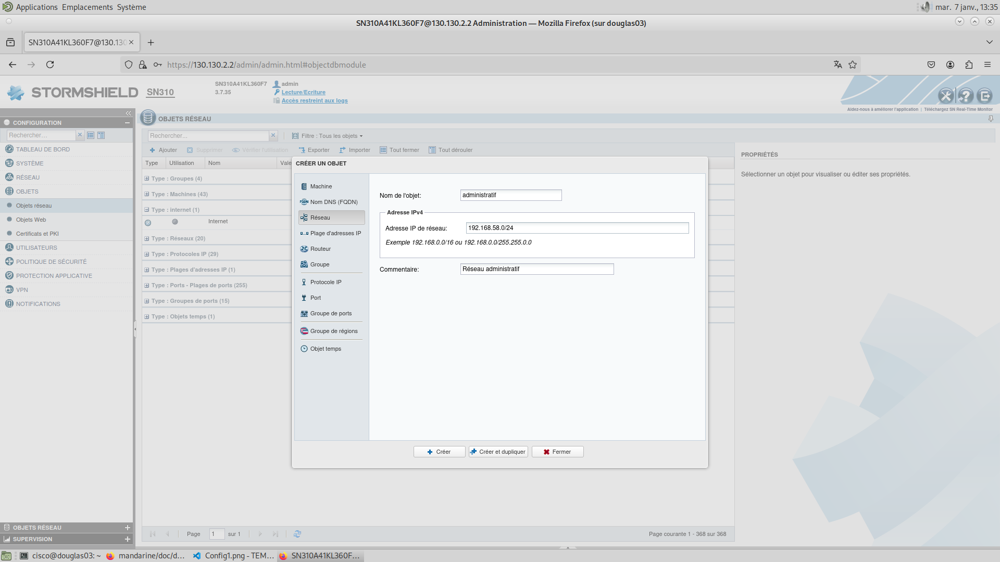

Pour la partie attribuée à la FAI dans le réseau public

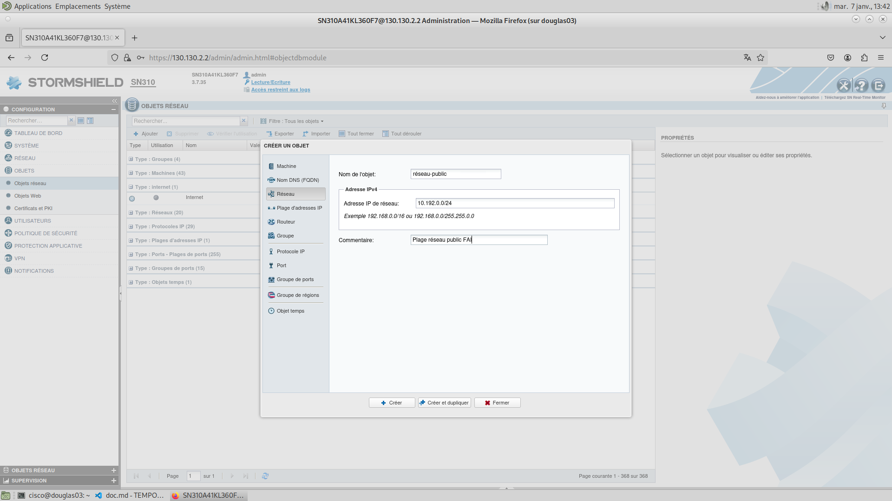

### Politique de sécurité -> Filtrage et NAT

1. Créer des règles ICMP pour effectuer des requêtes depuis le réseau privé vers l'extérieur et depuis la plage de réseau public atttribuée à la FAI vers le réseau privé.
2. Créer des règles pour le serveur mail et web
3. Créer des règles pour que le réseau privé puisse d'interroger le DNS

Il est nécessaire d'appliquer une règle par défaut en **Bloquer Tout** afin de pouvoir choisir ce que l'on laissera passer. Chaque règle crées devra agir dans les deux sens. On précisera la provenance ainsi que la destination et les ports/protocoles pour chaque règle.

Pour chacune des configurations suivantes, vous devez créer une nouvelle règle.
Séparer les différentes règles permet d'isoler les diffférents éléments pris en compte (ports/protocoles).
Pour créer une nouvelle règle, cliquez sur **Nouvelle règle**
Une nouvelle ligne est ajouté à la liste des règles existantes. En double cliquant dessus, vous pouvez l'éditer. Faites correspondre la règle à vos besoins. 
Ci-dessous, les configurations que nous avons utilisés.

---
### 1. Créer des règles ICMP.
**Depuis le réseau privé vers l'extérieur**

+ Général
    * Etat : ON
    * Commentaire : Allow Ping from internal
+ Action
    * Action : Passer
+ Source
    * Machines sources -> ajouter : Network_internals
+ Destination
    * Any
+ Port/protocole -> Section protocole
    * Type de protocole: Protocole IP
    * Protocole IP: icmp
    * Message ICMP: Tous types et codes

**Depuis la plage de réseau public atttribuée à la FAI vers le réseau privé**

+ Général
    * Etat : ON
    * Commentaire : Allow Ping from our Private
+ Action
    * Action : Passer
+ Source -> Machines sources (Ajouter)
    * reseau-public
    > C'est l'objet que nous avons configuré précédemment
+ Destination
    * Any
+ Port/protocole -> Section protocole
    * Type de protocole: Protocole IP
    * Protocole IP: icmp
    * Message ICMP: Tous types et codes

---
### 2. Créer des règles pour le serveur mail et web
**Commencer par créer des règles SMPT**
Depuis l'onglet Politique de Sécurité -> Filtrage SMTP
Créer une règle de filtrage. Par la suite, il faudra utiliser cette règle de filtrage. Il est possible de la renommer si nécessaire. 

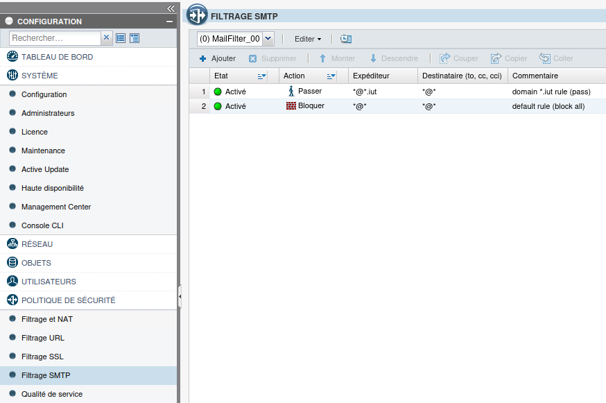

**Depuis le réseau privé vers l'extérieur**

+ Général
    * Etat : ON
    * Commentaire : Allow Mail and Web from internal
+ Action
    * Action : Passer
+ Source -> Machines sources (Ajouter)
    * Network_internals
+ Destination
    * Any
+ Port/protocole -> Section port (Ajouter)
    * smtp
    * imap
    * imaps
    * http
    * https
+ Inspection
    * Filtrage SMTP : MailFilter_00
    > C'est la règle SMTP précédemment configurée
    

**Depuis la plage de réseau public atttribuée à la FAI vers le réseau privé**

+ Général
    * Etat : ON
    * Commentaire : Allow Mail and Web from our public
+ Action
    * Action : Passer
+ Source -> Machines sources (Ajouter)
    * reseau-public
    > C'est l'objet que nous avons configuré précédemment
+ Destination
    * Network_internals
+ Port/protocole -> Section port (Ajouter)
    * smtp
    * imap
    * imaps
    * http
    * https

---
### 3. Créer des règles pour que le réseau privé puisse d'interroger le DNS

**Ecouter des DNS**

+ Général
    * Etat : ON
    * Commentaire : Allow DNS queries
+ Action
    * Action : Passer
+ Source -> Machines sources (Ajouter)
    * Any
+ Destination
    * Network_internals
+ Port/protocole -> Section port (Ajouter)
    * dns

**Interroger des DNS**

+ Général
    * Etat : ON
    * Commentaire : Allow DNS queries
+ Action
    * Action : Passer
+ Source -> Machines sources (Ajouter)
    * Network_internals
+ Destination
    * Any
+ Port/protocole -> Section port (Ajouter)
    * dns

---
## Problèmes rencontrés

Dans notre configuration, l'adresse par défaut du firewall (10.0.0.254) est déjà utilisée sur le routeur permettant de relier FAI à la région Afrique. Il est donc nécessaire de travailler en dehors du réseau public.

Un fois l'infrastructure installée, afin de tester l'interconnection entre les différents réseaux, on peut utiliser le protocole ICMP. Toutefois, puisque le firewall limite l'accès au réseau privé à notre plage de réseau public, il est important de préciser l'adresse d'émission du paquet ICMP s'il est émis depuis le routeur FAI.

Pour chacune des règles crées, on peut spécifier Networks_internals afin de mettre les objets réseaux crées à savoir Informatique et Administratif. L'avantage de spécifier les objets réseaux est que si l'on rajoute un nouveau réseau, il ne sera pas soumis par défaut aux mêmes règles que les autres. Cet avantage soulève aussi un inconvénient, si on oublie de le rajouter, il ne sera pas configuré comme les autres.