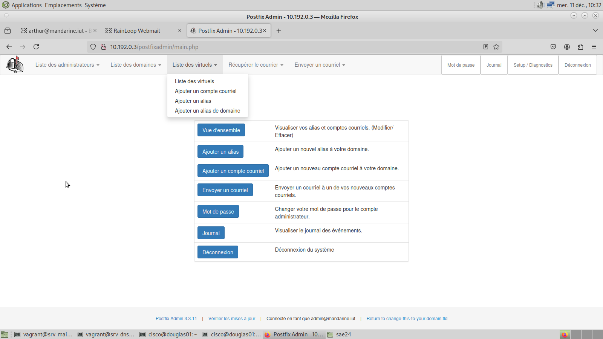
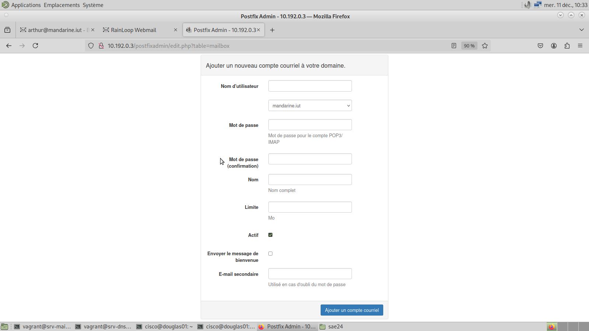
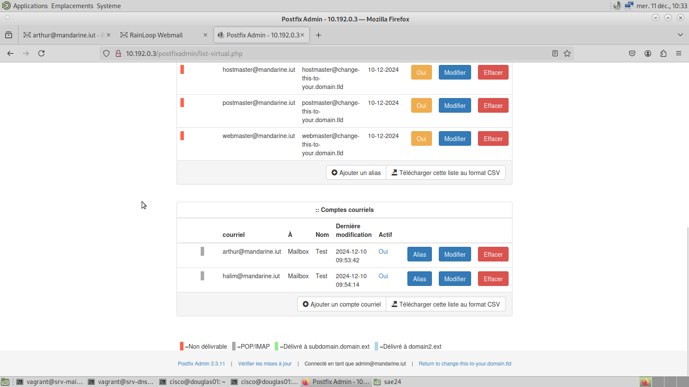

# Procédure pour ajouter des adresses mails

Cette procédure explique comment ajouter ou consulter des adresses mail dans Postfix.

## Connexion à Postfix en tant qu'administrateur

Pour accéder à l'interface administrateur de Postfix, suivez ces étapes :

1. Ouvrez un navigateur web, comme **Firefox**.  
2. Saisissez l’adresse suivante dans la barre de recherche :  
   [http://10.192.0.3/postfixadmin/login.php](http://10.192.0.3/postfixadmin/login.php)

3. Vous devriez voir une interface similaire à celle-ci :  
   

4. Connectez-vous avec les identifiants suivants :  
   - **Identifiant** : `admin@mandarine.iut`  
   - **Mot de passe** : `mandarine123!`

5. Une fois connecté, vous serez redirigé vers l’interface administrateur :  
   

## Ajouter une adresse mail

1. Dans l’interface administrateur, cliquez sur **Liste des virtuels**, puis sur **Ajouter un compte courriel**.  
   

2. Vous serez redirigé vers un formulaire d’ajout de compte :  
   

3. Remplissez le formulaire avec les informations requises (adresse, mot de passe, quota, etc.).  

4. Une fois le formulaire complété, cliquez sur **Ajouter un compte courriel** pour valider la création du compte.

## Consulter la liste des adresses mail

1. Cliquez sur **Liste des virtuels**, puis sur **Liste des virtuels**.  
   

2. Vous serez redirigé vers une page affichant un récapitulatif des alias et des comptes courriel existants :  
   

3. Faites défiler la page pour voir tous les comptes courriel enregistrés.