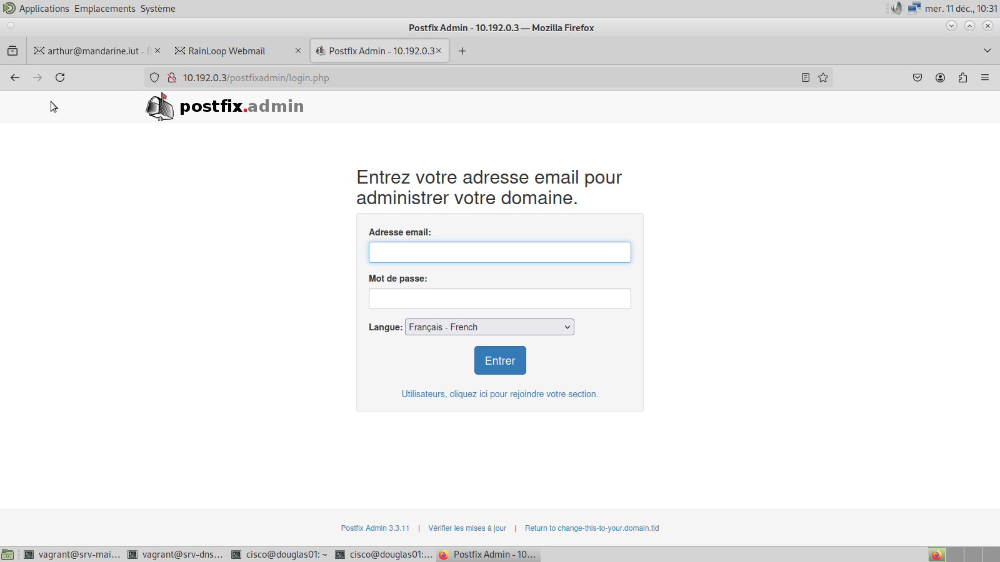
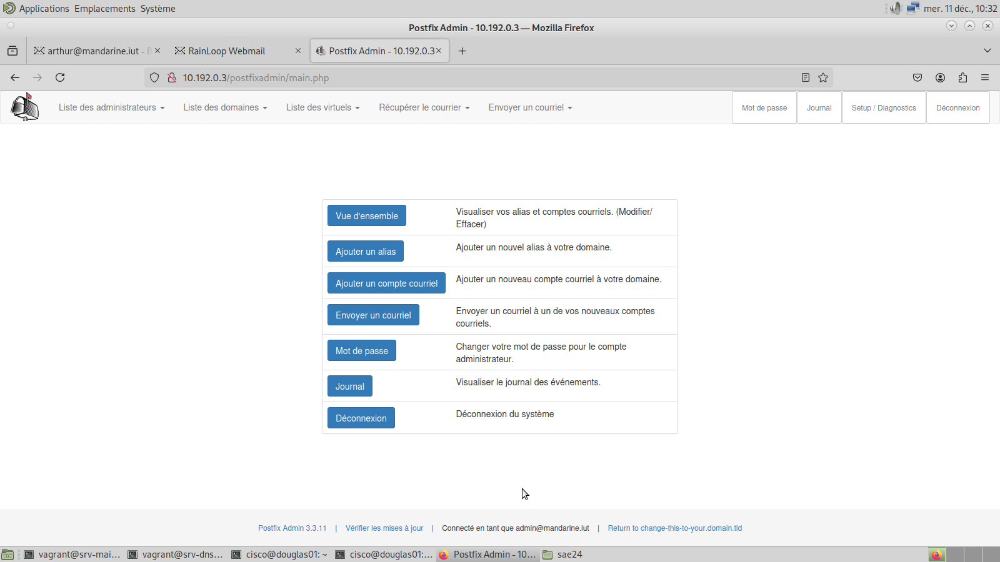
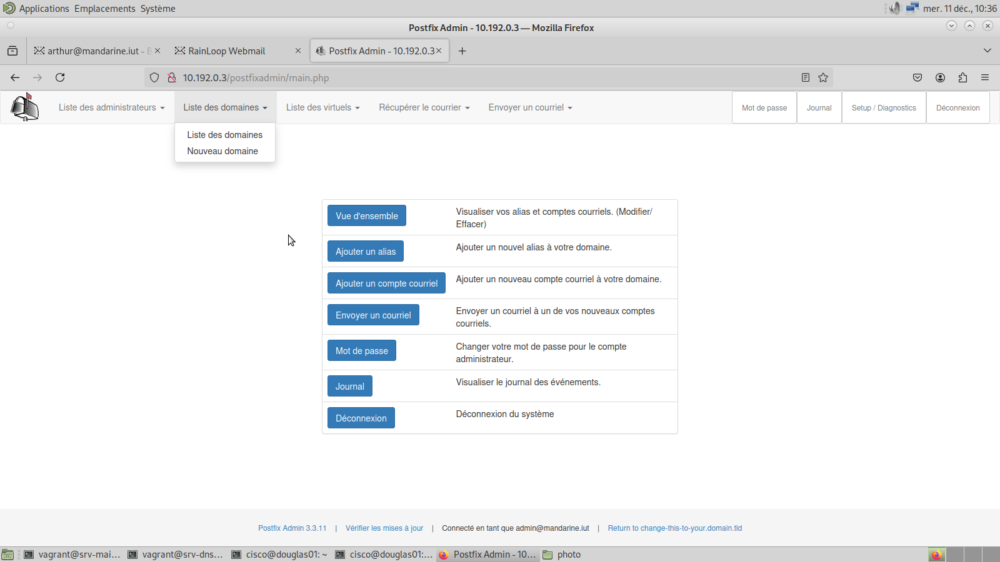

# Procédure pour ajouter des domaines dans Postfix

Cette procédure explique comment ajouter ou consulter les domaines dans Postfix.

## Connexion à Postfix en tant qu'administrateur

Pour accéder à l'interface administrateur de Postfix, procédez comme suit :  

1. Ouvrez un navigateur web, comme **Firefox**.  
2. Saisissez l’adresse suivante dans la barre de recherche :  
   [http://10.192.0.3/postfixadmin/login.php](http://10.192.0.3/postfixadmin/login.php)

3. Une interface semblable à celle-ci devrait s’afficher :  
   

4. Connectez-vous avec les identifiants administrateurs :  
   - **Identifiant** : `admin@mandarine.iut`  
   - **Mot de passe** : `mandarine123!`

5. Une fois connecté, vous accéderez à l’interface administrateur :  
   

## Ajouter un domaine

1. Dans l’interface administrateur, cliquez sur **Liste des domaines**, puis sur **Nouveau domaine**.  
   

2. Vous serez redirigé vers un formulaire permettant l’ajout d’un domaine :  
   

3. Remplissez le formulaire avec les informations requises :  
   - Nom du domaine  
   - Description  
   - Alias (si nécessaire)  
   - Autres paramètres spécifiques.  

4. Après avoir complété toutes les informations, cliquez sur **Ajouter un domaine** pour valider.

## Consulter la liste des domaines

1. Dans l’interface administrateur, cliquez sur **Liste des domaines**, puis sur **Liste des domaines**.  
   

2. Une page récapitulative des domaines enregistrés s’affichera :  
   

   Vous pourrez y consulter tous les domaines existants ainsi que leurs paramètres associés.
