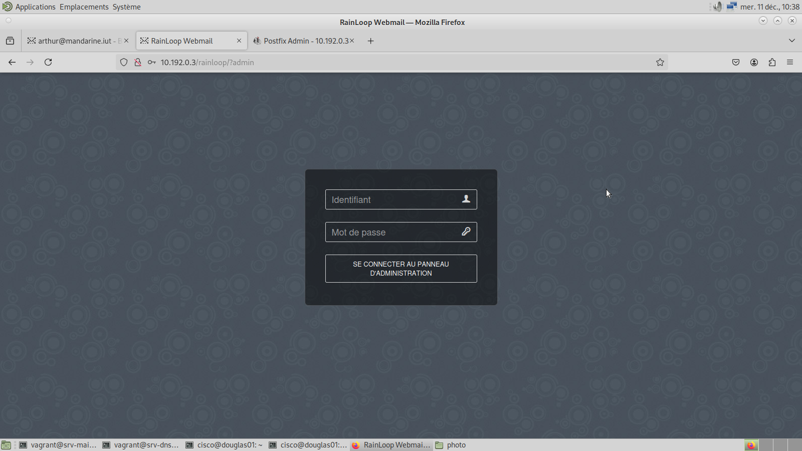
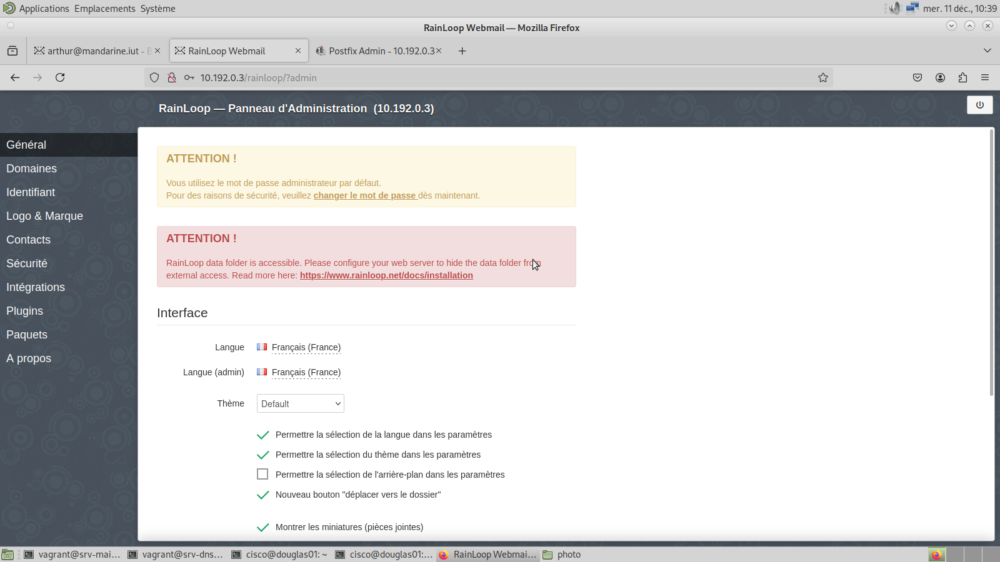
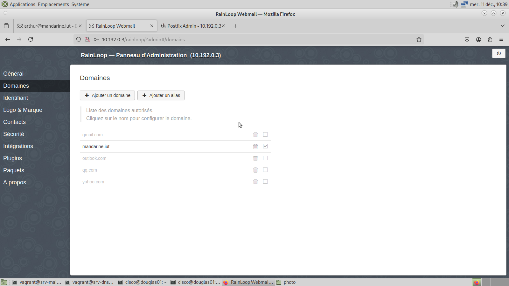
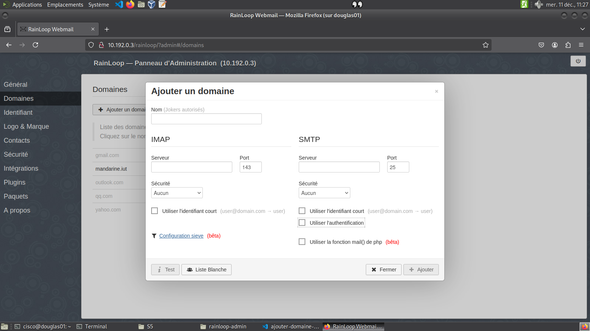
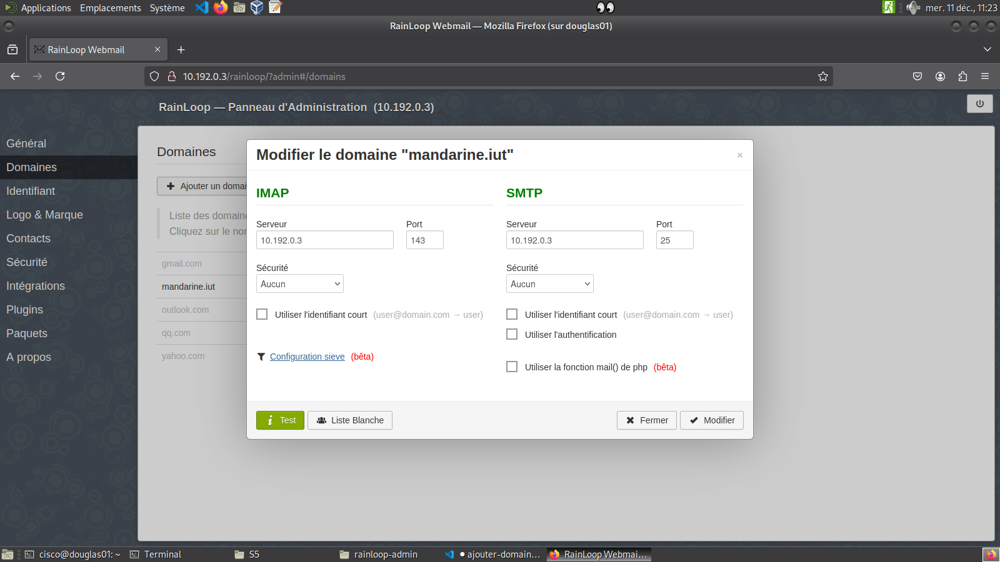

# Procédure pour gérer les domaines dans Rainloop

Cette procédure explique comment ajouter ou modifier des domaines dans Rainloop.

## Connexion à Rainloop en tant qu'administrateur

Pour accéder à l'interface administrateur de Rainloop, ouvrez un navigateur web. Dans cet exemple, nous utiliserons **Firefox**.  
1. Saisissez l’adresse suivante dans la barre de recherche :  
   [http://10.192.0.3/rainloop/?admin](http://10.192.0.3/rainloop/?admin)

2. Vous devriez voir une interface similaire à celle-ci :  
   

3. Connectez-vous avec les identifiants suivants :  
   - **Identifiant** : `admin`  
   - **Mot de passe** : `12345`  

4. Une fois connecté, vous serez redirigé vers l’interface administrateur :  
   

## Ajouter ou modifier un domaine

Pour gérer les domaines, accédez à l'onglet **Domaines** :  
1. Cliquez sur l’onglet **Domaines** dans le menu.  
   

2. Vous serez redirigé vers une interface similaire à celle-ci :  
   

### Ajouter un domaine

1. Cliquez sur **Ajouter un domaine**. Vous accéderez à un formulaire d’ajout :  
   

2. Remplissez le formulaire avec les informations requises.  
   - **Attention** : Décochez la case **Utiliser l'authentification**.

3. Après avoir rempli toutes les informations :  
   - Cliquez sur **Test**.  
   - Si tous les paramètres passent au vert (voir l’image ci-dessous), cliquez sur **Modifier** pour enregistrer le domaine.  
     

### Modifier un domaine

1. Sélectionnez le domaine que vous souhaitez modifier. Vous serez redirigé vers un formulaire similaire à celui-ci :  
   

2. Modifiez les informations nécessaires.

3. Avant de valider :  
   - Cliquez sur **Test**.  
   - Si tous les paramètres passent au vert (voir l’image ci-dessous), cliquez sur **Modifier** pour enregistrer les changements.  
     
