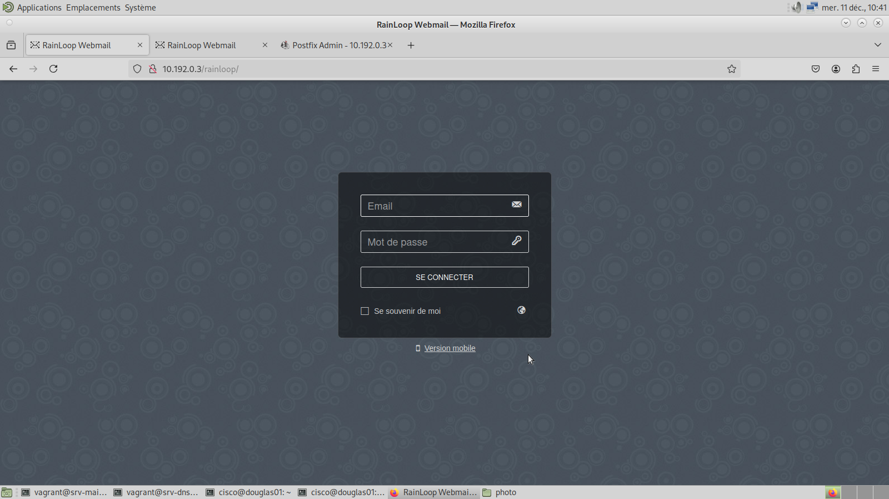

# Procédure pour gérer les mails des utilisateurs

Cette procédure explique comment les utilisateurs peuvent gérer leurs mails via Rainloop.

## Connexion au compte utilisateur

Pour accéder à Rainloop, ouvrez un navigateur web. Dans cet exemple, nous utiliserons **Firefox**. Une fois le navigateur lancé, saisissez l’adresse suivante dans la barre de recherche :  
[http://10.192.0.3/rainloop/](http://10.192.0.3/rainloop/)

Vous devriez arriver sur une interface similaire à celle-ci :  

1. Sur cette page, entrez votre adresse mail et votre mot de passe.  
   Exemple :  
   - **Adresse mail** : `arthur@mandarine.iut`  
   - **Mot de passe** : `arthur123!`

2. Une fois connecté, vous serez redirigé vers l’interface principale de Rainloop. Celle-ci devrait ressembler à l’image suivante :  

À partir de cette interface, vous pouvez :  
- Envoyer des mails,  
- Répondre aux messages reçus,  
- Gérer vos courriels (organisation, suppression, etc.).
