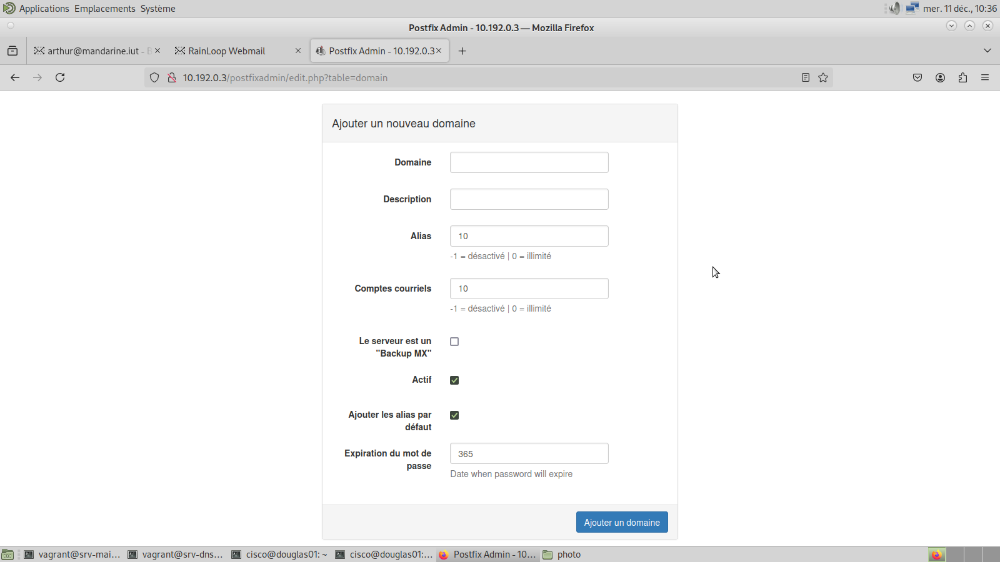
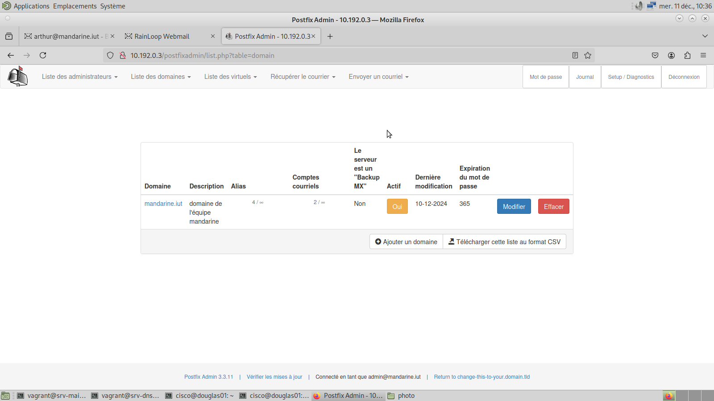

# Procédure d'installation du serveur mail

## Introduction 

Mise en place d'un service de mail avec Postfix, RainLoop, et Dovecot sur une machine virtuelle Debian.  
Postfix sera configuré en tant que serveur SMTP, Dovecot pour la sauvegarde des mails, et RainLoop sera utilisé comme client webmail.

## Pré-requis  
- Apache2  
- MariaDB  
- PHP 8.2  
- Postfix, Dovecot et RainLoop  
- Sous-domaine `mail.mandarine.iut` configuré  

## Source  
Tutoriel : [https://neptunet.fr/messagerie-debian/](https://neptunet.fr/messagerie-debian/)

## Installation des paquets et préparation du système

Commencez par mettre à jour le système et installer les services de base de la pile LAMP (Linux Apache MySQL PHP), ainsi que d'autres dépendances et utilitaires nécessaires :

```bash
apt-get update && apt-get upgrade -y
apt-get install apache2 mariadb-server php8.2 -y
apt-get install php8.2-mysql php8.2-mbstring php8.2-imap php8.2-xml php8.2-curl -y
service apache2 restart
apt-get install tree mailutils -y
apt-get install postfix postfix-mysql -y
apt-get install dovecot-mysql dovecot-pop3d dovecot-imapd dovecot-managesieved -y
apt-get install libapache2-mod-php php -y
```

Lors de l'installation de Postfix, vous devrez choisir le type de configuration `Site Internet`. Ensuite, entrez le nom complet du serveur de messagerie (*nom+domaine*), ici : `mail.mandarine.iut`.

Créez sur le serveur un groupe et un utilisateur local nommé « vmail », chargé de gérer les emails. Son **home directory** sera défini sur `/var/vmail` et contiendra l’ensemble des mails reçus par le serveur.

```bash
groupadd -g 5000 vmail
useradd -g vmail -u 5000 vmail -d /var/vmail -m
```

## Configuration de la base de données

Sécurisez MariaDB en définissant un mot de passe pour le compte `root` :

```bash
mysql_secure_installation
```

Une série de questions vous sera posée :  
- **Mot de passe actuel pour root** : `vagrant`.  
- **Set root password ? [Y/n]** : Tapez `Y` et définissez le mot de passe pour l'utilisateur `root`, ici : `MandarineIut123!`.  
- Pour les autres questions, répondez `Y`.  

Créez une base de données, des utilisateurs, et définissez les privilèges nécessaires :

```bash
mariadb -u root -p
```

Dans le terminal MySQL, exécutez les commandes suivantes :  

```sql
CREATE DATABASE postfix;
CREATE USER 'postfix'@'localhost' IDENTIFIED BY 'mandarine123!';
GRANT ALL PRIVILEGES ON `postfix`.* TO 'postfix'@'localhost';
CREATE USER 'mailuser'@'localhost' IDENTIFIED BY 'mandarine123!';
GRANT SELECT ON `postfix`.* TO 'mailuser'@'localhost';
FLUSH PRIVILEGES;
QUIT;
```

## Installation et configuration de Postfixadmin

Téléchargez et configurez Postfixadmin :  

```bash
cd /srv/
wget -O postfixadmin.tgz https://github.com/postfixadmin/postfixadmin/archive/postfixadmin-3.3.13.tar.gz
tar -zxvf postfixadmin.tgz
mv postfixadmin-postfixadmin-3.3.13 postfixadmin
ln -s /srv/postfixadmin/public /var/www/html/postfixadmin
```

Configurez Postfixadmin en éditant le fichier `config.local.php` :  

```bash
nano /srv/postfixadmin/config.local.php
```

Ajoutez les lignes suivantes, en remplaçant les valeurs si nécessaire :  

```php
<?php
$CONF['database_type'] = 'mysqli';
$CONF['database_host'] = 'localhost';
$CONF['database_name'] = 'postfix';
$CONF['database_user'] = 'postfix';
$CONF['database_password'] = 'mandarine123!';
$CONF['configured'] = true;
?>
```

Créez un dossier requis pour Postfixadmin et définissez ses permissions :  

```bash
mkdir -p /srv/postfixadmin/templates_c
chown -R www-data /srv/postfixadmin/templates_c
```

Accédez à l'interface web Postfixadmin pour terminer la configuration :  
[http://mail.mandarine.iut/postfixadmin/setup.php](http://mail.mandarine.iut/postfixadmin/setup.php) ou [http://10.192.0.3/postfixadmin/setup.php](http://10.192.0.3/postfixadmin/setup.php).

Une fois sur la page, définissez le mot de passe pour l'installation, ici : `mandarine123!`.


Le mot de passe sera alors **crypté**.


Copiez **toute la ligne fournie** et collez-la dans le fichier `config.local.php` :

```php
<?php
$CONF['database_type'] = 'mysqli';
$CONF['database_host'] = 'localhost';
$CONF['database_name'] = 'postfix';
$CONF['database_user'] = 'postfix';
$CONF['database_password'] = 'mandarine123!';
$CONF['configured'] = true;
$CONF['setup_password'] = 'Mot de passe crypté';
?>
```


Rechargez l'interface web de Postfixadmin, puis créez un compte d'administration.  

Utilisez les informations suivantes :  
- **Compte** : `admin@mandarine.iut`  
- **Mot de passe** : `AdminMandarine123!`  

Cliquez sur **Ajouter un administrateur**.  


Une fois le compte d’administration créé, le message suivant apparaîtra :  


Vous pouvez désormais vous connecter à l’interface web Postfixadmin via :  
[http://mail.mandarine.iut/postfixadmin/login.php](http://mail.mandarine.iut/postfixadmin/login.php) ou [http://10.192.0.3/postfixadmin/login.php](http://10.192.0.3/postfixadmin/login.php).


Voici un aperçu de la console d’administration :


Nous allons ajouter notre domaine. Cliquez sur **« Liste des domaines »** puis sur **« Nouveau domaine »** dans les onglets en haut de la page :  


Ajoutez votre domaine et définissez le nombre d’alias et de comptes courriers à **0** pour permettre une création illimitée. Remplissez le formulaire comme suit :

```conf
Domaine : mandarine.iut
Description : Domaine de mandarine.iut
Alias : 0
Comptes courriers : 0
Le serveur est un "Backup MX" : ne pas cocher
Actif : cocher
Ajouter des alias par défaut : cocher
Expiration du mot de passe : 365
```



Une fois le formulaire rempli et validé, vous pouvez vérifier que le domaine a bien été ajouté grâce à la **Liste des domaines** :



### Création des adresses de messagerie  

Vous pouvez maintenant créer vos adresses de messagerie. Cliquez sur **« Liste des virtuels »**, puis sur **« Ajouter un compte courrier »** dans les onglets en haut de la page :  


Remplissez le formulaire avec les informations souhaitées pour créer une nouvelle adresse :


Voilà pour la partie gestion des adresses mails ! Passons maintenant à la configuration de **Postfix** sur le serveur.

## Configuration de Postfix  

Configurez Postfix pour lier la base de données, ce qui permettra de gérer les domaines et les boîtes aux lettres.  

### Configuration des domaines virtuels  

1. Créer le fichier de configuration des domaines virtuels :  

   ```bash
   nano /etc/postfix/mysql-virtual-mailbox-domains.cf
   ```  

2. Ajoutez le contenu suivant :  

   ```conf
   user = mailuser
   password = mandarine123!
   hosts = 127.0.0.1
   dbname = postfix
   query = SELECT 1 FROM domain WHERE domain='%s'
   ```  

3. Enregistrez et fermez le fichier.  

4. Activez la configuration avec la commande suivante :  

   ```bash
   postconf -e virtual_mailbox_domains=mysql:/etc/postfix/mysql-virtual-mailbox-domains.cf
   ```  

### Configuration des boîtes aux lettres  

1. Ouvrez le fichier de configuration des boîtes aux lettres :  

   ```bash
   nano /etc/postfix/mysql-virtual-mailbox-maps.cf
   ```  

2. Ajoutez le contenu suivant :  

   ```conf
   user = mailuser
   password = mandarine123!
   hosts = 127.0.0.1
   dbname = postfix
   query = SELECT 1 FROM mailbox WHERE username='%s'
   ```  

3. Enregistrez et fermez le fichier.  

4. Activez la configuration avec la commande suivante :  

   ```bash
   postconf -e virtual_mailbox_maps=mysql:/etc/postfix/mysql-virtual-mailbox-maps.cf
   ```  

### Redémarrage de Postfix  

Appliquez les modifications en redémarrant Postfix :  

```bash
service postfix restart
```

## Configuration de Dovecot  

Configurez Dovecot pour qu’il puisse gérer les boîtes aux lettres et s’intégrer correctement avec Postfix.  

### 1. Configuration des mécanismes d’authentification  

1. Ouvrez le fichier `10-auth.conf` :  

   ```bash
   nano /etc/dovecot/conf.d/10-auth.conf
   ```  

2. Modifiez la ligne `auth_mechanisms` pour ajouter `login` :  

   ```conf
   auth_mechanisms = plain login
   ```  

3. À la fin du fichier, configurez Dovecot pour utiliser les utilisateurs en base de données :  
   - Commentez la ligne `! include auth-system.conf.ext`.  
   - Décommentez la ligne `! include auth-sql.conf.ext`.  

   Résultat attendu :  

   ```conf
   # ! include auth-system.conf.ext
   ! include auth-sql.conf.ext
   # ! include auth-ldap.conf.ext
   # ! include auth-passwdfile.conf.ext
   # ! include auth-checkpassword.conf.ext
   # ! include auth-static.conf.ext
   ```  

### 2. Configuration SQL pour les utilisateurs  

1. Ouvrez le fichier `auth-sql.conf.ext` :  

   ```bash
   nano /etc/dovecot/conf.d/auth-sql.conf.ext
   ```  

2. Remplacez le bloc `userdb` par celui-ci :  

   ```conf
   userdb {
     driver = static
     args = uid=vmail gid=vmail home=/var/vmail/%d/%n
   }
   ```  

### 3. Configuration des emplacements des mails  

1. Ouvrez le fichier `10-mail.conf` :  

   ```bash
   nano /etc/dovecot/conf.d/10-mail.conf
   ```  

2. Modifiez la ligne `mail_location` pour qu’elle corresponde au chemin suivant :  

   ```conf
   mail_location = maildir:/var/vmail/%d/%n/Maildir
   ```  

### 4. Configuration pour l’authentification avec Postfix  

1. Éditez le fichier `10-master.conf` :  

   ```bash
   nano /etc/dovecot/conf.d/10-master.conf
   ```  

2. Dans le bloc `service auth`, ajoutez les lignes suivantes sous `# Postfix smtp-auth` :  

   ```conf
   unix_listener /var/spool/postfix/private/auth {
     mode = 0666
     user = postfix
     group = postfix
   }
   ```  

3. Ajoutez les lignes suivanyes à la fin du fichier :

   ```conf
   service stats {
      unix_listener stats-reader {
         user = vmail
         group = vmail
         mode = 0660
      }

      unix_listener stats-writer {
         user = vmail
         group = vmail
         mode = 0660
      }
   }
   ```
### 5. Configuration de la connexion à la base de données  

1. Placez-vous dans le dossier `/etc/dovecot` :  

   ```bash
   cd /etc/dovecot
   ```  

2. Modifiez le fichier `dovecot-sql.conf.ext` :  

   ```bash
   nano /etc/dovecot/dovecot-sql.conf.ext
   ```  

3. Ajoutez les lignes suivantes à la fin du fichier :  

   ```conf
   driver = mysql
   connect = host=127.0.0.1 dbname=postfix user=mailuser password=mandarine123!
   password_query = SELECT username, domain, password FROM mailbox WHERE username='%u';
   ```  

### 6. Configuration des permissions  

Modifiez les droits du fichier principal de configuration de Dovecot pour qu’il soit accessible par l’utilisateur `vmail` :  

```bash
chgrp vmail /etc/dovecot/dovecot.conf
chmod g+r /etc/dovecot/dovecot.conf
```  

### 7. Redémarrage de Dovecot  

Appliquez toutes les modifications en redémarrant le service :  

```bash
service dovecot restart
```  

## Mise en place de la liaison Postfix <-> Dovecot  

### 1. Configuration de `master.cf`  

Ajoutez la configuration suivante à la fin du fichier `/etc/postfix/master.cf` :  

```bash
nano /etc/postfix/master.cf
```  

```conf
dovecot   unix  -       n       n       -       -       pipe
  flags=DRhu user=vmail:vmail argv=/usr/lib/dovecot/dovecot-lda -f ${sender} -d ${recipient}
```  

### 2. Appliquez les modifications à Postfix  

Redémarrez le service Postfix pour prendre en compte les modifications :  

```bash
service postfix restart
```  

Ensuite, configurez Postfix pour utiliser Dovecot en tant que transport des mails et limitez le traitement à un seul destinataire à la fois :  

```bash
postconf -e virtual_transport=dovecot
postconf -e dovecot_destination_recipient_limit=1
```  

### 3. Vérification de la configuration  

#### 3.1 Vérifiez le contenu initial de `/var/vmail`  

Le dossier `/var/vmail` devrait être vide avant l’envoi d’un email. Utilisez la commande suivante pour le confirmer :  

```bash
tree /var/vmail
```  

#### 3.2 Envoi d’un email de test  

Envoyez un email de test à l’utilisateur précédemment créé :  

```bash
echo "test" | mail nomutilisateur@mandarine.iut
```  

#### 3.3 Vérifiez les logs de Postfix  

Consultez les logs pour vous assurer que l’email a été correctement traité :  

```bash
tail -f /var/log/mail.log
```  

Recherchez des messages indiquant que l’email a été remis avec succès dans les logs.  

#### 3.4 Vérifiez la création de l’arborescence des mails  

Répétez la commande `tree` pour vérifier qu’une arborescence a été créée dans `/var/vmail` :  

```bash
tree /var/vmail
```  

Une arborescence similaire à celle-ci devrait apparaître :  

```plaintext
/var/vmail
└── mandarine.iut
    └── nomutilisateur
        └── Maildir
            ├── cur
            ├── new
            │   └── 1672345678.0.mailsrv
            └── tmp
```  

Le dossier `new` contient le fichier correspondant à l’email envoyé.  

**Félicitations !**  
Le serveur de messagerie est maintenant correctement configuré et fonctionnel. Vous pouvez désormais envoyer et recevoir des emails via le domaine `mandarine.iut` !

## Installation et configuration de Rainloop  

Rainloop est un client webmail léger et facile à configurer. Suivez ces étapes pour l'installer et le configurer avec votre serveur de messagerie.  

### 1. Installation de Rainloop  

1. **Téléchargez et installez Rainloop** :  
   Placez-vous dans le répertoire web et utilisez le script officiel pour installer Rainloop :  

   ```bash
   mkdir /var/www/html/rainloop
   cd /var/www/html/rainloop
   wget -qO- https://repository.rainloop.net/installer.php | php
   ```  

2. **Appliquez les permissions appropriées** :  

   ```bash
   find . -type d -exec chmod 755 {} \;
   find . -type f -exec chmod 644 {} \;
   chown -R www-data:www-data .
   ```  

### 2. Configuration d'Apache pour Rainloop  

1. **Copiez la configuration par défaut d’Apache pour créer une configuration dédiée** :  

   ```bash
   cp /etc/apache2/sites-available/000-default.conf /etc/apache2/sites-available/rainloop.conf
   ```  

2. **Modifiez le fichier `/etc/apache2/sites-available/rainloop.conf`** :  

   Remplacez la ligne :  

   ```conf
   DocumentRoot /var/www/html
   ```  

   par :  

   ```conf
   DocumentRoot /var/www/html/rainloop
   ```  

3. **Activez le site et redémarrez Apache** :  

   ```bash
   a2ensite rainloop.conf
   service apache2 restart
   ```  

### 3. Accès à l’administration Rainloop  

Accédez à l'interface d'administration de Rainloop en ouvrant l'URL suivante dans un navigateur :  
[http://10.192.0.3/rainloop/?admin](http://10.192.0.3/rainloop/?admin).  

**Identifiants par défaut** :  
- **Login** : `admin`  
- **Mot de passe** : `12345`  

### 4. Configuration du domaine  

1. Connectez-vous à l’interface d’administration de Rainloop. Vous serez redirigé vers l’interface principale.  

2. **Changez la langue** si nécessaire en naviguant dans les paramètres.  

3. **Ajoutez le domaine `mandarine.iut`** :  
   - Allez dans le menu **Domaines**.  
   - Cliquez sur « **+ Ajouter un domaine** ».  
   - Remplissez le formulaire comme suit :  

      **IMAP** :  
      - Serveur : `10.192.0.3` ou `mail.mandarine.iut`  
      - Port : `143`  
      - Sécurité : `Aucune`  
      - Utiliser l’identifiant court : **décochez**  

      **SMTP** :  
      - Serveur : `10.192.0.3` ou `mail.mandarine.iut`  
      - Port : `25`  
      - Sécurité : `Aucune`  
      - Utiliser l’identifiant court : **décochez**  
      - Utiliser l’authentification : **décochez**  
      - Utiliser la fonction `mail()` de PHP : **décochez**  

4. **Testez la configuration** :  
   - Cliquez sur le bouton « **Test** ».  
   - Si le test est réussi (affichage en vert), cliquez sur « **+ Ajouter** ».  

### 5. Test de Rainloop  

1. Accédez à l'interface utilisateur de Rainloop via l'une des URL suivantes :  
   - [http://mail.mandarine.iut/rainloop/](http://mail.mandarine.iut/rainloop/)  
   - [http://10.192.0.3/rainloop/](http://10.192.0.3/rainloop/)  

2. **Connectez-vous avec les identifiants d’un utilisateur** que vous avez créé dans Postfixadmin :  
   - **Email** : `nomutilisateur@mandarine.iut`  
   - **Mot de passe** : celui défini dans Postfixadmin.  

3. Une fois connecté, vous pouvez envoyer, recevoir et gérer vos emails depuis l’interface utilisateur de Rainloop.  

### 6. Résultat attendu  

- **Connexion utilisateur** :  
    

- **Interface utilisateur** :  
    


**Félicitations !** 
Vous avez terminé la configuration et l’installation de votre serveur de messagerie ainsi que de Rainloop.

## **Ressources supplémentaires : Personnalisation et gestion du serveur mail**

Pour enrichir ou modifier les fonctionnalités de votre serveur de messagerie, consultez les guides suivants :  
- [Ajouter une adresse mail](./ajouter-adresse-mail.md)  
- [Gérer ses adresses mail](./gerer-mails.md)  
- [Ajouter un domaine dans Rainloop](./ajouter-domaine-rainloop.md)  
- [Ajouter un domaine dans Postfix](./ajouter-domaine-postfix.md)  
