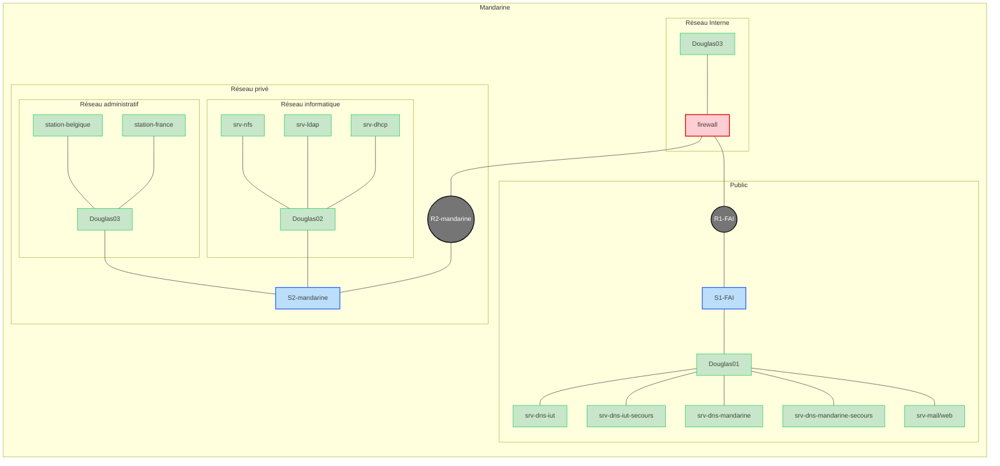

# Schéma réseau de notre infrastructure

```mermaid
flowchart BT
    subgraph s1["Public"]
        n1(("R1-FAI"))
        n2["S1-FAI"]
        n3["Douglas01"]
        n4["srv-dns-iut"]
        n5["srv-dns-iut-secours"]
        n6["srv-dns-mandarine"]
        n7["srv-dns-mandarine-secours"]
        n8["srv-mail/web"]
    end

    subgraph s2["Réseau Interne"]
        n9["firewall"]
        n12["Douglas03"]
    end

    subgraph s4["Réseau informatique"]
        n13["Douglas02"]
        n15["srv-dhcp"]
        n16["srv-ldap"]
        n17["srv-nfs"]
    end

    subgraph s5["Réseau administratif"]
        n14["Douglas03"]
        n18["station-france"]
        n19["station-belgique"]
    end

    subgraph s3["Réseau privé"]
        n10(("R2-mandarine"))
        n11["S2-mandarine"]
        s4
        s5
    end

    subgraph s6["Mandarine"]
        s1
        s2
        s3
    end

    n1 --- n2
    n2 --- n3
    n3 --- n4
    n3 --- n5
    n3 --- n6
    n3 --- n7
    n3 --- n8
    n10 --- n11
    n12 --- n9
    n15 --- n13
    n16 --- n13
    n17 --- n13
    n13 --- n11
    n9 --- n1
    n9 --- n10
    n18 --- n14
    n19 --- n14
    n14 --- n11

    %% Classes
    class n1,n10 routeur
    class n2,n11 switch
    class n3,n4,n5,n6,n7,n8,n12,n13,n14,n15,n16,n17,n18,n19 station
    class n9 firewall

    %% Style des classes
    classDef switch stroke-width:2px, stroke-dasharray:0, stroke:#2962FF, fill:#BBDEFB, color:#424242
    classDef station stroke:#00C853, fill:#C8E6C9, color:#424242
    classDef firewall stroke-width:2px, stroke-dasharray:0, stroke:#D50000, fill:#FFCDD2, color:#424242
    classDef routeur stroke-width:2px, stroke-dasharray:0, stroke:#000000, fill:#757575, color:#FFFFFF

```