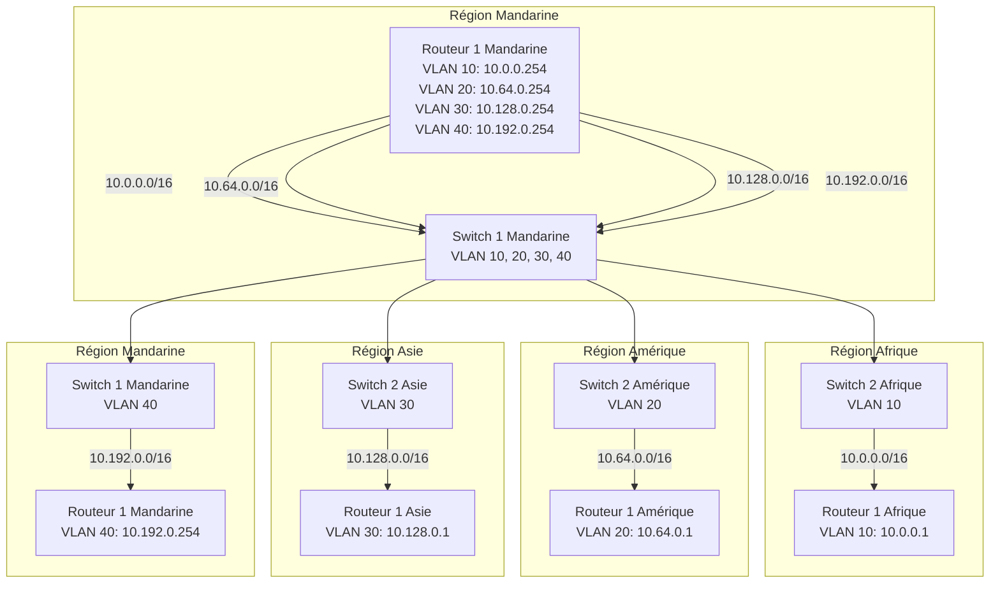

## Schéma du réseau publique

```mermaid
flowchart TD
    %% Région Mandarine
    subgraph RegionMandarine [Région Mandarine]
        A[Routeur 1 Mandarine 
        VLAN 10: 10.0.0.254 
        VLAN 20: 10.64.0.254 
        VLAN 30: 10.128.0.254 
        VLAN 40: 10.192.0.254]
        B[Switch 1 Mandarine\nVLAN 10, 20, 30, 40]
        A -->|10.0.0.0/16| B
        A -->|10.64.0.0/16| B
        A -->|10.128.0.0/16| B
        A -->|10.192.0.0/16| B
    end

    %% Région Afrique
    subgraph RegionAfrique [Région Afrique]
        C[Switch 2 Afrique
        VLAN 10]
        G[Routeur 1 Afrique
        VLAN 10: 10.0.0.1]
        C -->|10.0.0.0/16| G
    end

    %% Région Amérique
    subgraph RegionAmerique [Région Amérique]
        D[Switch 2 Amérique
        VLAN 20]
        H[Routeur 1 Amérique
        VLAN 20: 10.64.0.1]
        D -->|10.64.0.0/16| H
    end

    %% Région Asie
    subgraph RegionAsie [Région Asie]
        E[Switch 2 Asie
        VLAN 30]
        I[Routeur 1 Asie
        VLAN 30: 10.128.0.1]
        E -->|10.128.0.0/16| I
    end

    %% Région Mandarine (Sous-réseau)
    subgraph RegionMandarineSub [Région Mandarine ]
        F[Switch 1 Mandarine
        VLAN 40]
        J[Routeur 1 Mandarine
        VLAN 40: 10.192.0.254]
        F -->|10.192.0.0/16| J
    end

    %% Connexions entre les différentes régions
    B --> C
    B --> D
    B --> E
    B --> F
```